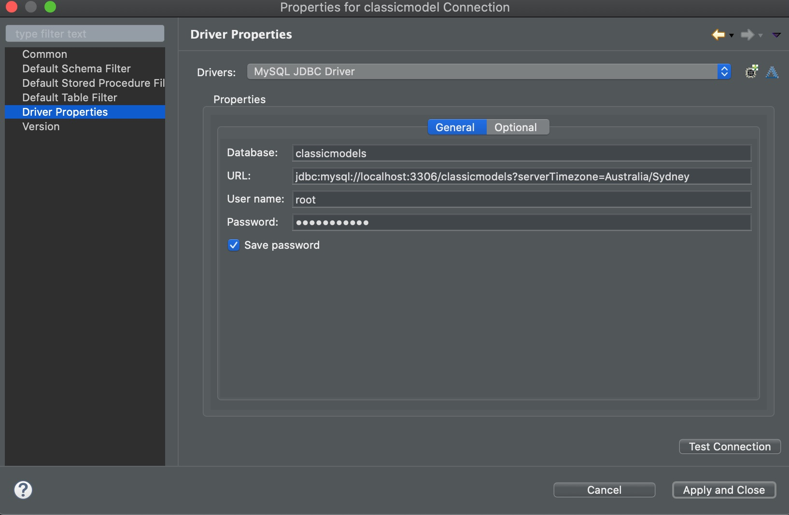

# LeetcodeRepos

This repository collects my practice on Leetcode

## Prerequisites

IDE
- Eclipse

Depenency: 
- JRE requires Java SE 8
- JUnit 5
- MySQL installed


### MySQL Connection Setup
add following to pom.xml
```
<dependency>
    <groupId>mysql</groupId>
    <artifactId>mysql-connector-java</artifactId>
    <version>8.0.17</version>
</dependency>
```

go to Windows -> Show View -> Others -> Data Management -> Data Source Explorer -> Database Collection
right click and create MySQL profile -> edit driver properties

Note that: request parameter "serverTimeZone" in URL is added for solving connection error of timezone mismatch.
If connection works, no need to add request parameter.